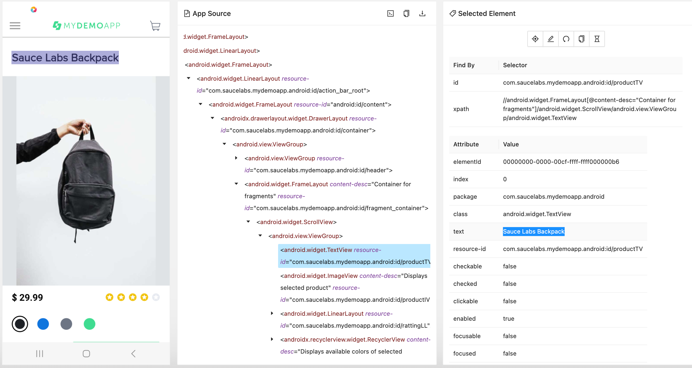
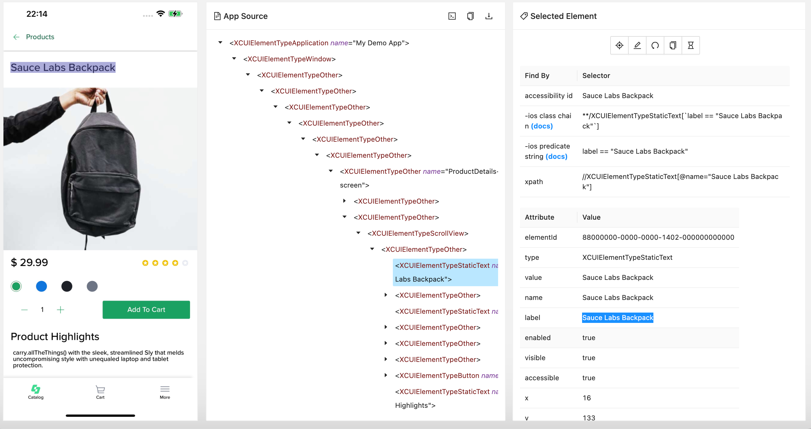

# WebdriverIO: Native App Automation Across Platforms

Cross-platform mobile automation using Page Object Model (POM).   
This project has WebdriverIO 8 tests with mocha and typescript, followed by the page objects pattern running on the Sauce Labs platform.   

Features:
- Cloud testing Integration with Sauce Labs
- Page Object Pattern
- Cross platform support
  - Android real device
  - iOS real device
  - Android emulator
  - iOS simulator
- Cross platform parallel execution
- Appium


## Why I developed this project?
I developed this project to understand how to run the same test on Android and iOS OS.   
### The main challenges

The main challenges to run the same test on Android and iOS OS are:
1.	<b>Selectors</b>    
Selectors (or locators) are essentially mechanisms used to identify and interact with elements within a mobile application's user interface. They help the test scripts locate buttons, text fields, checkboxes, and other interactive components to simulate user interactions accurately.    
However, Android and iOS applications are built using distinct UI frameworks and guidelines, leading to variations in how elements are represented in the UI hierarchy.        
Here is an example for the same native app page and how the App source looks like in Android:
          
      and in iOS
      
2. <b>Divergent Business Flows between Android and iOS</b>   
   Developing Appium tests to be executed on both Android and iOS platforms introduces another significant challenge: the potential variance in business flows or user interactions between the two operating systems. This difference arises from the reality that many organizations maintain separate teams for Android and iOS development, leading to platform-specific design and user experience considerations.


### The Approaches
1. <b>Selectors</b>    
   I use cross-platform mobile automation using Page Object Model (POM) 
   For each screen (I call 'screen' for a Native App page) I defined 'get' methods to return the locators. 
   For example:

   ```bash
    public get addToCartBtn () {
        if (driver.isAndroid)
            return $('~Tap to add product to cart');
        else
            return $('~AddToCart');
    }    

    ```

bla

    ```bash
    public async addProductToCart () {
        await this.addToCartBtn.click()
    }
         
    ```

2. <b>Divergent Business Flows between Android and iOS</b>    
   Sometime during run time, we need to perform a different approach depend if we run on Android device or iOS device.
   We can do that by calling the driver method 'isAndroid'.    
   For example, calling the Appium commands to terminte and activate the app:
```bash
export async function restartApp() {
    if (!driver.firstAppStart) {
        if (driver.isAndroid) {
            await driver.terminateApp("com.saucelabs.mydemoapp.android");
            await driver.activateApp("com.saucelabs.mydemoapp.android");
        }
        else {
            await driver.terminateApp("com.saucelabs.mydemoapp.ios");
            await driver.activateApp("com.saucelabs.mydemoapp.ios");
        }
    }
```

## Install dependencies

You can install all dependencies by running the following command

    npm install

This will install all needed dependencies that are listed in the `package.json`-file

> NOTE: Make sure you are in the folder `sauce-wdio-appium-all` when you execute this command

## Download / Upload Apps

You can download and use the Android app from [here](https://github.com/saucelabs/my-demo-app-android/releases/). Make sure you rename the app to:

- Android Emulators / Real Devices: `mda-*.*.*-**.apk` => `my-demo-app-android.apk`

You can download and use the iOS apps from [here](https://github.com/saucelabs/my-demo-app-ios/releases/). Make sure the apps names are:

- iOS Real Devices: `SauceLabs-Demo-App.ipa`
- iOS Simulators: `SauceLabs-Demo-App.Simulator.zip`

And manually upload them to the preferred Data Center, see [this](https://docs.saucelabs.com/mobile-apps/live-testing/live-mobile-app-testing/#uploading-an-app) for the instructions.

## Run tests on Sauce Labs

You can run your tests on Sauce Labs US DC with this command

    # Run on all platforms ( Android, iOS, real devices, emulators/simulators) Tests
    npm run test.saucelabs.us

You can run your tests on Sauce Labs EU DC with this command

    # Run on all platforms ( Android, iOS, real devices, emulators/simulators) Tests
    npm run test.saucelabs.eu


<details>
    <summary>Click to expand and see logs from running this on Sauce Labs for Android Real Devices</summary>

```logs
sauce-wdio-appium-all % npm run test.saucelabs.eu

> sauce-wdio-appium-all@1.0.0 test.saucelabs.eu
> REGION=eu npx wdio run ./wdio.conf.ts


Execution of 8 workers started at 2023-12-11T14:03:29.921Z

2023-12-11T14:03:30.065Z INFO @wdio/cli:launcher: Run onPrepare hook
2023-12-11T14:03:30.068Z INFO @wdio/cli:launcher: Run onWorkerStart hook
2023-12-11T14:03:30.069Z INFO @wdio/cli:launcher: Run onWorkerStart hook
2023-12-11T14:03:30.069Z INFO @wdio/cli:launcher: Run onWorkerStart hook
2023-12-11T14:03:30.069Z INFO @wdio/cli:launcher: Run onWorkerStart hook
2023-12-11T14:03:30.069Z INFO @wdio/cli:launcher: Run onWorkerStart hook
2023-12-11T14:03:30.069Z INFO @wdio/cli:launcher: Run onWorkerStart hook
2023-12-11T14:03:30.069Z INFO @wdio/cli:launcher: Run onWorkerStart hook
2023-12-11T14:03:30.069Z INFO @wdio/cli:launcher: Run onWorkerStart hook
2023-12-11T14:03:30.069Z INFO @wdio/local-runner: Start worker 0-0 with arg: run,./wdio.conf.ts
2023-12-11T14:03:30.075Z INFO @wdio/local-runner: Start worker 1-0 with arg: run,./wdio.conf.ts
2023-12-11T14:03:30.077Z INFO @wdio/local-runner: Start worker 2-0 with arg: run,./wdio.conf.ts
2023-12-11T14:03:30.079Z INFO @wdio/local-runner: Start worker 3-0 with arg: run,./wdio.conf.ts
2023-12-11T14:03:30.081Z INFO @wdio/local-runner: Start worker 0-1 with arg: run,./wdio.conf.ts
2023-12-11T14:03:30.083Z INFO @wdio/local-runner: Start worker 1-1 with arg: run,./wdio.conf.ts
2023-12-11T14:03:30.085Z INFO @wdio/local-runner: Start worker 2-1 with arg: run,./wdio.conf.ts
2023-12-11T14:03:30.088Z INFO @wdio/local-runner: Start worker 3-1 with arg: run,./wdio.conf.ts
[1-0] 2023-12-11T14:03:31.655Z INFO @wdio/local-runner: Run worker command: run
[2-0] 2023-12-11T14:03:31.656Z INFO @wdio/local-runner: Run worker command: run
[0-1] 2023-12-11T14:03:31.656Z INFO @wdio/local-runner: Run worker command: run
[0-0] 2023-12-11T14:03:31.656Z INFO @wdio/local-runner: Run worker command: run
[2-1] 2023-12-11T14:03:31.656Z INFO @wdio/local-runner: Run worker command: run
[3-0] 2023-12-11T14:03:31.657Z INFO @wdio/local-runner: Run worker command: run
[3-1] 2023-12-11T14:03:31.658Z INFO @wdio/local-runner: Run worker command: run
[1-1] 2023-12-11T14:03:31.658Z INFO @wdio/local-runner: Run worker command: run
[2-0] I'm in iOS
[2-0] RUNNING in iOS - file:///test/specs/test.catalog.spec.ts
[2-0] 2023-12-11T14:03:32.183Z INFO webdriver: Initiate new session using the WebDriver protocol
[2-0] 2023-12-11T14:03:32.183Z INFO @wdio/utils: Connecting to existing driver at https://ondemand.eu-central-1.saucelabs.com:443/wd/hub
[2-1] I'm in iOS
[0-0] I'm in Android
[0-0] 2023-12-11T14:03:32.189Z INFO webdriver: Initiate new session using the WebDriver protocol
[0-0] 2023-12-11T14:03:32.190Z INFO @wdio/utils: Connecting to existing driver at https://ondemand.eu-central-1.saucelabs.com:443/wd/hub
[1-1] I'm in Android
[0-0] RUNNING in Android - file:///test/specs/test.catalog.spec.ts
[2-1] RUNNING in iOS - file:///test/specs/test.product.details.spec.ts
[1-0] I'm in Android
[2-1] 2023-12-11T14:03:32.192Z INFO webdriver: Initiate new session using the WebDriver protocol
[2-1] 2023-12-11T14:03:32.192Z INFO @wdio/utils: Connecting to existing driver at https://ondemand.eu-central-1.saucelabs.com:443/wd/hub
[3-0] I'm in iOS
[1-0] RUNNING in Android - file:///test/specs/test.catalog.spec.ts
[3-0] RUNNING in iOS - file:///test/specs/test.catalog.spec.ts
[1-0] 2023-12-11T14:03:32.194Z INFO webdriver: Initiate new session using the WebDriver protocol
[1-0] 2023-12-11T14:03:32.194Z INFO @wdio/utils: Connecting to existing driver at https://ondemand.eu-central-1.saucelabs.com:443/wd/hub
[3-0] 2023-12-11T14:03:32.194Z INFO webdriver: Initiate new session using the WebDriver protocol
[3-0] 2023-12-11T14:03:32.194Z INFO @wdio/utils: Connecting to existing driver at https://ondemand.eu-central-1.saucelabs.com:443/wd/hub
[1-1] RUNNING in Android - file:///test/specs/test.product.details.spec.ts
[1-1] 2023-12-11T14:03:32.196Z INFO webdriver: Initiate new session using the WebDriver protocol
[1-1] 2023-12-11T14:03:32.196Z INFO @wdio/utils: Connecting to existing driver at https://ondemand.eu-central-1.saucelabs.com:443/wd/hub
[3-1] I'm in iOS
[3-1] RUNNING in iOS - file:///test/specs/test.product.details.spec.ts
[3-1] 2023-12-11T14:03:32.204Z INFO webdriver: Initiate new session using the WebDriver protocol
[3-1] 2023-12-11T14:03:32.204Z INFO @wdio/utils: Connecting to existing driver at https://ondemand.eu-central-1.saucelabs.com:443/wd/hub
[0-1] I'm in Android
[0-1] RUNNING in Android - file:///test/specs/test.product.details.spec.ts
[0-1] 2023-12-11T14:03:32.213Z INFO webdriver: Initiate new session using the WebDriver protocol
[0-1] 2023-12-11T14:03:32.213Z INFO @wdio/utils: Connecting to existing driver at https://ondemand.eu-central-1.saucelabs.com:443/wd/hub
[3-1] 2023-12-11T14:03:32.273Z INFO webdriver: [POST] https://ondemand.eu-central-1.saucelabs.com/wd/hub/session
[2-0] 2023-12-11T14:03:32.273Z INFO webdriver: [POST] https://ondemand.eu-central-1.saucelabs.com/wd/hub/session
[1-0] 2023-12-11T14:03:32.273Z INFO webdriver: [POST] https://ondemand.eu-central-1.saucelabs.com/wd/hub/session
[1-0] 2023-12-11T14:03:32.274Z INFO webdriver: DATA {
[1-0]   capabilities: {
[1-0]     alwaysMatch: {
[1-0]       platformName: 'Android',
[1-0]       'appium:app': 'storage:filename=my-demo-app-android.apk',
[1-0]       'appium:deviceName': 'Samsung.*',
[1-0]       'appium:platformVersion': '13',
[1-0]       'appium:automationName': 'UiAutomator2',
[1-0]       'sauce:options': [Object]
[1-0]     },
[1-0]     firstMatch: [ {} ]
[1-0]   },
[1-0]   desiredCapabilities: {
[1-0]     platformName: 'Android',
[1-0]     'appium:app': 'storage:filename=my-demo-app-android.apk',
[1-0]     'appium:deviceName': 'Samsung.*',
[1-0]     'appium:platformVersion': '13',
[1-0]     'appium:automationName': 'UiAutomator2',
[1-0]     'sauce:options': {
[1-0]       appiumVersion: 'latest',
[1-0]       phoneOnly: 'true',
[1-0]       build: ' build-1702303410'
[1-0]     }
[1-0]   }
[1-0] }
[0-0] 2023-12-11T14:03:32.273Z INFO webdriver: [POST] https://ondemand.eu-central-1.saucelabs.com/wd/hub/session
[0-0] 2023-12-11T14:03:32.274Z INFO webdriver: DATA {
[0-0]   capabilities: {
[0-0]     alwaysMatch: {
[0-0]       platformName: 'Android',
[0-0]       'appium:app': 'storage:filename=my-demo-app-android.apk',
[0-0]       'appium:deviceName': 'Android GoogleAPI Emulator',
[0-0]       'appium:platformVersion': '12',
[0-0]       'appium:automationName': 'UiAutomator2',
[0-0]       'appium:appWaitActivity': 'view.activities.MainActivity',
[0-0]       'sauce:options': [Object]
[0-0]     },
[0-0]     firstMatch: [ {} ]
[0-0]   },
[0-0]   desiredCapabilities: {
[0-0]     platformName: 'Android',
[0-0]     'appium:app': 'storage:filename=my-demo-app-android.apk',
[0-0]     'appium:deviceName': 'Android GoogleAPI Emulator',
[0-0]     'appium:platformVersion': '12',
[0-0]     'appium:automationName': 'UiAutomator2',
[0-0]     'appium:appWaitActivity': 'view.activities.MainActivity',
[0-0]     'sauce:options': { appiumVersion: '2.0.0', build: ' build-1702303410' }
[0-0]   }
[0-0] }
[3-0] 2023-12-11T14:03:32.273Z INFO webdriver: [POST] https://ondemand.eu-central-1.saucelabs.com/wd/hub/session
[3-0] 2023-12-11T14:03:32.274Z INFO webdriver: DATA {
[3-0]   capabilities: {
[3-0]     alwaysMatch: {
[3-0]       platformName: 'iOS',
[3-0]       'appium:app': 'storage:filename=SauceLabs-Demo-App.ipa',
[3-0]       'appium:deviceName': 'iphone.*',
[3-0]       'appium:platformVersion': '14',
[3-0]       'appium:automationName': 'XCuiTest',
[3-0]       'sauce:options': [Object]
[3-0]     },
[3-0]     firstMatch: [ {} ]
[3-0]   },
[3-0]   desiredCapabilities: {
[3-0]     platformName: 'iOS',
[3-0]     'appium:app': 'storage:filename=SauceLabs-Demo-App.ipa',
[3-0]     'appium:deviceName': 'iphone.*',
[3-0]     'appium:platformVersion': '14',
[3-0]     'appium:automationName': 'XCuiTest',
[3-0]     'sauce:options': {
[3-0]       appiumVersion: 'latest',
[3-0]       phoneOnly: 'true',
[3-0]       build: ' build-1702303410'
[3-0]     }
[3-0]   }
[3-0] }
[1-1] 2023-12-11T14:03:32.273Z INFO webdriver: [POST] https://ondemand.eu-central-1.saucelabs.com/wd/hub/session
[1-1] 2023-12-11T14:03:32.274Z INFO webdriver: DATA {
[1-1]   capabilities: {
[1-1]     alwaysMatch: {
[1-1]       platformName: 'Android',
[1-1]       'appium:app': 'storage:filename=my-demo-app-android.apk',
[1-1]       'appium:deviceName': 'Samsung.*',
[1-1]       'appium:platformVersion': '13',
[1-1]       'appium:automationName': 'UiAutomator2',
[1-1]       'sauce:options': [Object]
[1-1]     },
[1-1]     firstMatch: [ {} ]
[1-1]   },
[1-1]   desiredCapabilities: {
[1-1]     platformName: 'Android',
[1-1]     'appium:app': 'storage:filename=my-demo-app-android.apk',
[1-1]     'appium:deviceName': 'Samsung.*',
[1-1]     'appium:platformVersion': '13',
[1-1]     'appium:automationName': 'UiAutomator2',
[1-1]     'sauce:options': {
[1-1]       appiumVersion: 'latest',
[1-1]       phoneOnly: 'true',
[1-1]       build: ' build-1702303410'
[1-1]     }
[1-1]   }
[1-1] }
[3-1] 2023-12-11T14:03:32.274Z INFO webdriver: DATA {
[3-1]   capabilities: {
[3-1]     alwaysMatch: {
[3-1]       platformName: 'iOS',
[3-1]       'appium:app': 'storage:filename=SauceLabs-Demo-App.ipa',
[3-1]       'appium:deviceName': 'iphone.*',
[3-1]       'appium:platformVersion': '14',
[3-1]       'appium:automationName': 'XCuiTest',
[3-1]       'sauce:options': [Object]
[3-1]     },
[3-1]     firstMatch: [ {} ]
[3-1]   },
[3-1]   desiredCapabilities: {
[3-1]     platformName: 'iOS',
[3-1]     'appium:app': 'storage:filename=SauceLabs-Demo-App.ipa',
[3-1]     'appium:deviceName': 'iphone.*',
[3-1]     'appium:platformVersion': '14',
[3-1]     'appium:automationName': 'XCuiTest',
[3-1]     'sauce:options': {
[3-1]       appiumVersion: 'latest',
[3-1]       phoneOnly: 'true',
[3-1]       build: ' build-1702303410'
[3-1]     }
[3-1]   }
[3-1] }
[2-0] 2023-12-11T14:03:32.274Z INFO webdriver: DATA {
[2-0]   capabilities: {
[2-0]     alwaysMatch: {
[2-0]       platformName: 'iOS',
[2-0]       'appium:app': 'storage:filename=SauceLabs-Demo-App.Simulator.zip',
[2-0]       'appium:deviceName': 'iPhone Instant Simulator',
[2-0]       'appium:platformVersion': 'current_major',
[2-0]       'appium:automationName': 'XCuiTest',
[2-0]       'sauce:options': [Object]
[2-0]     },
[2-0]     firstMatch: [ {} ]
[2-0]   },
[2-0]   desiredCapabilities: {
[2-0]     platformName: 'iOS',
[2-0]     'appium:app': 'storage:filename=SauceLabs-Demo-App.Simulator.zip',
[2-0]     'appium:deviceName': 'iPhone Instant Simulator',
[2-0]     'appium:platformVersion': 'current_major',
[2-0]     'appium:automationName': 'XCuiTest',
[2-0]     'sauce:options': { appiumVersion: '2.0.0', build: ' build-1702303410' }
[2-0]   }
[2-0] }
[0-1] 2023-12-11T14:03:32.275Z INFO webdriver: [POST] https://ondemand.eu-central-1.saucelabs.com/wd/hub/session
[0-1] 2023-12-11T14:03:32.275Z INFO webdriver: DATA {
[0-1]   capabilities: {
[0-1]     alwaysMatch: {
[0-1]       platformName: 'Android',
[0-1]       'appium:app': 'storage:filename=my-demo-app-android.apk',
[0-1]       'appium:deviceName': 'Android GoogleAPI Emulator',
[0-1]       'appium:platformVersion': '12',
[0-1]       'appium:automationName': 'UiAutomator2',
[0-1]       'appium:appWaitActivity': 'view.activities.MainActivity',
[0-1]       'sauce:options': [Object]
[0-1]     },
[0-1]     firstMatch: [ {} ]
[0-1]   },
[0-1]   desiredCapabilities: {
[0-1]     platformName: 'Android',
[0-1]     'appium:app': 'storage:filename=my-demo-app-android.apk',
[0-1]     'appium:deviceName': 'Android GoogleAPI Emulator',
[0-1]     'appium:platformVersion': '12',
[0-1]     'appium:automationName': 'UiAutomator2',
[0-1]     'appium:appWaitActivity': 'view.activities.MainActivity',
[0-1]     'sauce:options': { appiumVersion: '2.0.0', build: ' build-1702303410' }
[0-1]   }
[0-1] }
[2-1] 2023-12-11T14:03:32.275Z INFO webdriver: [POST] https://ondemand.eu-central-1.saucelabs.com/wd/hub/session
[2-1] 2023-12-11T14:03:32.275Z INFO webdriver: DATA {
[2-1]   capabilities: {
[2-1]     alwaysMatch: {
[2-1]       platformName: 'iOS',
[2-1]       'appium:app': 'storage:filename=SauceLabs-Demo-App.Simulator.zip',
[2-1]       'appium:deviceName': 'iPhone Instant Simulator',
[2-1]       'appium:platformVersion': 'current_major',
[2-1]       'appium:automationName': 'XCuiTest',
[2-1]       'sauce:options': [Object]
[2-1]     },
[2-1]     firstMatch: [ {} ]
[2-1]   },
[2-1]   desiredCapabilities: {
[2-1]     platformName: 'iOS',
[2-1]     'appium:app': 'storage:filename=SauceLabs-Demo-App.Simulator.zip',
[2-1]     'appium:deviceName': 'iPhone Instant Simulator',
[2-1]     'appium:platformVersion': 'current_major',
[2-1]     'appium:automationName': 'XCuiTest',
[2-1]     'sauce:options': { appiumVersion: '2.0.0', build: ' build-1702303410' }
[2-1]   }
[2-1] }
[2-0] 2023-12-11T14:03:44.116Z INFO webdriver: COMMAND executeScript("sauce:job-name=Catalog tests", <object>)
[2-0] 2023-12-11T14:03:44.117Z INFO webdriver: [POST] https://ondemand.eu-central-1.saucelabs.com/wd/hub/session/fd65c486538b42ff921a6d2f8d8621ed/execute/sync
[2-0] 2023-12-11T14:03:44.117Z INFO webdriver: DATA { script: 'sauce:job-name=Catalog tests', args: [] }
[2-0] 2023-12-11T14:03:44.218Z INFO webdriver: RESULT 
[2-0] 2023-12-11T14:03:44.220Z INFO webdriver: COMMAND findElement("accessibility id", "Catalog-screen")
[2-0] 2023-12-11T14:03:44.221Z INFO webdriver: [POST] https://ondemand.eu-central-1.saucelabs.com/wd/hub/session/fd65c486538b42ff921a6d2f8d8621ed/element
[2-0] 2023-12-11T14:03:44.221Z INFO webdriver: DATA { using: 'accessibility id', value: 'Catalog-screen' }
[2-0] 2023-12-11T14:03:44.951Z INFO webdriver: RESULT {
[2-0]   'element-6066-11e4-a52e-4f735466cecf': '0C000000-0000-0000-F110-000000000000',
[2-0]   ELEMENT: '0C000000-0000-0000-F110-000000000000'
[2-0] }
[2-0] 2023-12-11T14:03:44.958Z INFO webdriver: COMMAND isElementDisplayed("0C000000-0000-0000-F110-000000000000")
[2-0] 2023-12-11T14:03:44.959Z INFO webdriver: [GET] https://ondemand.eu-central-1.saucelabs.com/wd/hub/session/fd65c486538b42ff921a6d2f8d8621ed/element/0C000000-0000-0000-F110-000000000000/displayed
[2-0] 2023-12-11T14:03:45.360Z INFO webdriver: RESULT true
[2-0] 2023-12-11T14:03:45.361Z INFO webdriver: COMMAND executeScript("sauce:context=Catalog tests - should be able to load the catalog screen", <object>)
[2-0] 2023-12-11T14:03:45.361Z INFO webdriver: [POST] https://ondemand.eu-central-1.saucelabs.com/wd/hub/session/fd65c486538b42ff921a6d2f8d8621ed/execute/sync
[2-0] 2023-12-11T14:03:45.362Z INFO webdriver: DATA {
[2-0]   script: 'sauce:context=Catalog tests - should be able to load the catalog screen',
[2-0]   args: []
[2-0] }
[2-0] 2023-12-11T14:03:45.425Z INFO webdriver: RESULT 
[2-0] 2023-12-11T14:03:45.426Z INFO webdriver: COMMAND terminateApp("com.saucelabs.mydemoapp.ios")
[2-0] 2023-12-11T14:03:45.427Z INFO webdriver: [POST] https://ondemand.eu-central-1.saucelabs.com/wd/hub/session/fd65c486538b42ff921a6d2f8d8621ed/appium/device/terminate_app
[2-0] 2023-12-11T14:03:45.427Z INFO webdriver: DATA { appId: 'com.saucelabs.mydemoapp.ios' }
[2-0] 2023-12-11T14:03:46.596Z INFO webdriver: RESULT true
[2-0] 2023-12-11T14:03:46.597Z INFO webdriver: COMMAND activateApp("com.saucelabs.mydemoapp.ios")
[2-0] 2023-12-11T14:03:46.598Z INFO webdriver: [POST] https://ondemand.eu-central-1.saucelabs.com/wd/hub/session/fd65c486538b42ff921a6d2f8d8621ed/appium/device/activate_app
[2-0] 2023-12-11T14:03:46.598Z INFO webdriver: DATA { appId: 'com.saucelabs.mydemoapp.ios' }
[2-1] 2023-12-11T14:03:46.700Z INFO webdriver: COMMAND executeScript("sauce:job-name=Product details tests", <object>)
[2-1] 2023-12-11T14:03:46.700Z INFO webdriver: [POST] https://ondemand.eu-central-1.saucelabs.com/wd/hub/session/3da6d549734a4b8d819783631794363f/execute/sync
[2-1] 2023-12-11T14:03:46.701Z INFO webdriver: DATA { script: 'sauce:job-name=Product details tests', args: [] }
[2-1] 2023-12-11T14:03:46.845Z INFO webdriver: RESULT 
[2-1] 2023-12-11T14:03:46.848Z INFO webdriver: COMMAND executeScript("sauce:context=Product details tests - should be able to add product to cart", <object>)
[2-1] 2023-12-11T14:03:46.849Z INFO webdriver: [POST] https://ondemand.eu-central-1.saucelabs.com/wd/hub/session/3da6d549734a4b8d819783631794363f/execute/sync
[2-1] 2023-12-11T14:03:46.849Z INFO webdriver: DATA {
[2-1]   script: 'sauce:context=Product details tests - should be able to add product to cart',
[2-1]   args: []
[2-1] }
[2-1] 2023-12-11T14:03:46.940Z INFO webdriver: RESULT 
[2-1] 2023-12-11T14:03:46.943Z INFO webdriver: COMMAND findElement("accessibility id", "Catalog-screen")
[2-1] 2023-12-11T14:03:46.944Z INFO webdriver: [POST] https://ondemand.eu-central-1.saucelabs.com/wd/hub/session/3da6d549734a4b8d819783631794363f/element
[2-1] 2023-12-11T14:03:46.944Z INFO webdriver: DATA { using: 'accessibility id', value: 'Catalog-screen' }
[2-1] 2023-12-11T14:03:47.586Z INFO webdriver: RESULT {
[2-1]   'element-6066-11e4-a52e-4f735466cecf': '0C000000-0000-0000-E710-000000000000',
[2-1]   ELEMENT: '0C000000-0000-0000-E710-000000000000'
[2-1] }
[2-1] 2023-12-11T14:03:47.599Z INFO webdriver: COMMAND isElementDisplayed("0C000000-0000-0000-E710-000000000000")
[2-1] 2023-12-11T14:03:47.599Z INFO webdriver: [GET] https://ondemand.eu-central-1.saucelabs.com/wd/hub/session/3da6d549734a4b8d819783631794363f/element/0C000000-0000-0000-E710-000000000000/displayed
[2-1] 2023-12-11T14:03:47.983Z INFO webdriver: RESULT true
[2-1] I'm in checkIfDisplayedWithSwipeUp. amount =  0
[2-1] 2023-12-11T14:03:47.984Z INFO webdriver: COMMAND findElement("accessibility id", "Sauce Labs Backpack")
[2-1] 2023-12-11T14:03:47.985Z INFO webdriver: [POST] https://ondemand.eu-central-1.saucelabs.com/wd/hub/session/3da6d549734a4b8d819783631794363f/element
[2-1] 2023-12-11T14:03:47.985Z INFO webdriver: DATA { using: 'accessibility id', value: 'Sauce Labs Backpack' }
[2-1] 2023-12-11T14:03:48.667Z INFO webdriver: RESULT {
[2-1]   'element-6066-11e4-a52e-4f735466cecf': '41000000-0000-0000-E710-000000000000',
[2-1]   ELEMENT: '41000000-0000-0000-E710-000000000000'
[2-1] }
[2-1] 2023-12-11T14:03:48.671Z INFO webdriver: COMMAND isElementDisplayed("41000000-0000-0000-E710-000000000000")
[2-1] 2023-12-11T14:03:48.671Z INFO webdriver: [GET] https://ondemand.eu-central-1.saucelabs.com/wd/hub/session/3da6d549734a4b8d819783631794363f/element/41000000-0000-0000-E710-000000000000/displayed
[2-1] 2023-12-11T14:03:49.042Z INFO webdriver: RESULT true
[2-1] 2023-12-11T14:03:49.043Z INFO webdriver: COMMAND findElement("accessibility id", "Sauce Labs Backpack")
[2-1] 2023-12-11T14:03:49.044Z INFO webdriver: [POST] https://ondemand.eu-central-1.saucelabs.com/wd/hub/session/3da6d549734a4b8d819783631794363f/element
[2-1] 2023-12-11T14:03:49.044Z INFO webdriver: DATA { using: 'accessibility id', value: 'Sauce Labs Backpack' }
[2-1] 2023-12-11T14:03:49.620Z INFO webdriver: RESULT {
[2-1]   'element-6066-11e4-a52e-4f735466cecf': '41000000-0000-0000-E710-000000000000',
[2-1]   ELEMENT: '41000000-0000-0000-E710-000000000000'
[2-1] }
[2-1] 2023-12-11T14:03:49.624Z INFO webdriver: COMMAND elementClick("41000000-0000-0000-E710-000000000000")
[2-1] 2023-12-11T14:03:49.624Z INFO webdriver: [POST] https://ondemand.eu-central-1.saucelabs.com/wd/hub/session/3da6d549734a4b8d819783631794363f/element/41000000-0000-0000-E710-000000000000/click
[2-0] 2023-12-11T14:03:49.675Z INFO webdriver: RESULT null
[2-0] 2023-12-11T14:03:49.675Z INFO webdriver: COMMAND findElement("accessibility id", "Catalog-screen")
[2-0] 2023-12-11T14:03:49.675Z INFO webdriver: [POST] https://ondemand.eu-central-1.saucelabs.com/wd/hub/session/fd65c486538b42ff921a6d2f8d8621ed/element
[2-0] 2023-12-11T14:03:49.675Z INFO webdriver: DATA { using: 'accessibility id', value: 'Catalog-screen' }
[2-0] 2023-12-11T14:03:50.320Z INFO webdriver: RESULT {
[2-0]   'element-6066-11e4-a52e-4f735466cecf': '0C000000-0000-0000-F710-000000000000',
[2-0]   ELEMENT: '0C000000-0000-0000-F710-000000000000'
[2-0] }
[2-0] 2023-12-11T14:03:50.324Z INFO webdriver: COMMAND isElementDisplayed("0C000000-0000-0000-F710-000000000000")
[2-0] 2023-12-11T14:03:50.324Z INFO webdriver: [GET] https://ondemand.eu-central-1.saucelabs.com/wd/hub/session/fd65c486538b42ff921a6d2f8d8621ed/element/0C000000-0000-0000-F710-000000000000/displayed
[2-0] 2023-12-11T14:03:50.650Z INFO webdriver: RESULT true
[2-0] 2023-12-11T14:03:50.651Z INFO webdriver: COMMAND executeScript("sauce:context=Catalog tests - should be able to select product from the top of the catalog", <object>)
[2-0] 2023-12-11T14:03:50.651Z INFO webdriver: [POST] https://ondemand.eu-central-1.saucelabs.com/wd/hub/session/fd65c486538b42ff921a6d2f8d8621ed/execute/sync
[2-0] 2023-12-11T14:03:50.651Z INFO webdriver: DATA {
[2-0]   script: 'sauce:context=Catalog tests - should be able to select product from the top of the catalog',
[2-0]   args: []
[2-0] }
[2-0] 2023-12-11T14:03:50.715Z INFO webdriver: RESULT 
[2-0] I'm in checkIfDisplayedWithSwipeUp. amount =  0
[2-0] 2023-12-11T14:03:50.716Z INFO webdriver: COMMAND findElement("accessibility id", "Sauce Labs Backpack")
[2-0] 2023-12-11T14:03:50.717Z INFO webdriver: [POST] https://ondemand.eu-central-1.saucelabs.com/wd/hub/session/fd65c486538b42ff921a6d2f8d8621ed/element
[2-0] 2023-12-11T14:03:50.717Z INFO webdriver: DATA { using: 'accessibility id', value: 'Sauce Labs Backpack' }
[2-0] 2023-12-11T14:03:51.281Z INFO webdriver: RESULT {
[2-0]   'element-6066-11e4-a52e-4f735466cecf': '41000000-0000-0000-F710-000000000000',
[2-0]   ELEMENT: '41000000-0000-0000-F710-000000000000'
[2-0] }
[2-0] 2023-12-11T14:03:51.288Z INFO webdriver: COMMAND isElementDisplayed("41000000-0000-0000-F710-000000000000")
[2-0] 2023-12-11T14:03:51.289Z INFO webdriver: [GET] https://ondemand.eu-central-1.saucelabs.com/wd/hub/session/fd65c486538b42ff921a6d2f8d8621ed/element/41000000-0000-0000-F710-000000000000/displayed
[2-0] 2023-12-11T14:03:51.593Z INFO webdriver: RESULT true
[2-0] 2023-12-11T14:03:51.594Z INFO webdriver: COMMAND findElement("accessibility id", "Sauce Labs Backpack")
[2-0] 2023-12-11T14:03:51.594Z INFO webdriver: [POST] https://ondemand.eu-central-1.saucelabs.com/wd/hub/session/fd65c486538b42ff921a6d2f8d8621ed/element
[2-0] 2023-12-11T14:03:51.594Z INFO webdriver: DATA { using: 'accessibility id', value: 'Sauce Labs Backpack' }
[2-1] 2023-12-11T14:03:51.776Z INFO webdriver: RESULT null
[2-1] 2023-12-11T14:03:51.777Z INFO webdriver: COMMAND findElement("accessibility id", "ProductDetails-screen")
[2-1] 2023-12-11T14:03:51.777Z INFO webdriver: [POST] https://ondemand.eu-central-1.saucelabs.com/wd/hub/session/3da6d549734a4b8d819783631794363f/element
[2-1] 2023-12-11T14:03:51.777Z INFO webdriver: DATA { using: 'accessibility id', value: 'ProductDetails-screen' }
^[[1;2B[2-0] 2023-12-11T14:03:52.129Z INFO webdriver: RESULT {
[2-0]   'element-6066-11e4-a52e-4f735466cecf': '41000000-0000-0000-F710-000000000000',
[2-0]   ELEMENT: '41000000-0000-0000-F710-000000000000'
[2-0] }
[2-0] 2023-12-11T14:03:52.135Z INFO webdriver: COMMAND elementClick("41000000-0000-0000-F710-000000000000")
[2-0] 2023-12-11T14:03:52.135Z INFO webdriver: [POST] https://ondemand.eu-central-1.saucelabs.com/wd/hub/session/fd65c486538b42ff921a6d2f8d8621ed/element/41000000-0000-0000-F710-000000000000/click
[2-1] 2023-12-11T14:03:52.229Z INFO webdriver: RESULT {
[2-1]   'element-6066-11e4-a52e-4f735466cecf': '77000000-0000-0000-E710-000000000000',
[2-1]   ELEMENT: '77000000-0000-0000-E710-000000000000'
[2-1] }
[2-1] 2023-12-11T14:03:52.233Z INFO webdriver: COMMAND isElementDisplayed("77000000-0000-0000-E710-000000000000")
[2-1] 2023-12-11T14:03:52.234Z INFO webdriver: [GET] https://ondemand.eu-central-1.saucelabs.com/wd/hub/session/3da6d549734a4b8d819783631794363f/element/77000000-0000-0000-E710-000000000000/displayed
[2-1] 2023-12-11T14:03:52.517Z INFO webdriver: RESULT true
[2-1] 2023-12-11T14:03:52.518Z INFO webdriver: COMMAND findElement("xpath", "//XCUIElementTypeImage[@name="GrayRoundView Icons"]/../XCUIElementTypeStaticText")
[2-1] 2023-12-11T14:03:52.519Z INFO webdriver: [POST] https://ondemand.eu-central-1.saucelabs.com/wd/hub/session/3da6d549734a4b8d819783631794363f/element
[2-1] 2023-12-11T14:03:52.519Z INFO webdriver: DATA {
[2-1]   using: 'xpath',
[2-1]   value: '//XCUIElementTypeImage[@name="GrayRoundView Icons"]/../XCUIElementTypeStaticText'
[2-1] }
^[[1;2B[2-1] 2023-12-11T14:03:53.459Z INFO webdriver: RESULT {
[2-1]   error: 'no such element',
[2-1]   message: 'An element could not be located on the page using the given search parameters.',
[2-1]   stacktrace: 'NoSuchElementError: An element could not be located on the page using the given search parameters.\n' +
[2-1]     '    at XCUITestDriver.doNativeFind (/Volumes/Sauce/selenium/appium-v2.0.0/appium_home/darwin/node_modules/appium-xcuitest-driver/lib/commands/find.js:143:13)\n' +
[2-1]     '    at processTicksAndRejections (node:internal/process/task_queues:95:5)\n' +
[2-1]     '    at XCUITestDriver.findNativeElementOrElements (/Volumes/Sauce/selenium/appium-v2.0.0/appium_home/darwin/node_modules/appium-xcuitest-driver/lib/commands/find.js:97:12)\n' +
[2-1]     '    at XCUITestDriver.findElOrEls (/Volumes/Sauce/selenium/appium-v2.0.0/appium_home/darwin/node_modules/appium-xcuitest-driver/lib/commands/find.js:24:14)\n' +
[2-1]     '    at XCUITestDriver.findElOrElsWithProcessing (/Volumes/Sauce/selenium/appium-v2.0.0/packages/base-driver/lib/basedriver/commands/find.ts:60:12)\n' +
[2-1]     '    at XCUITestDriver.findElement (/Volumes/Sauce/selenium/appium-v2.0.0/packages/base-driver/lib/basedriver/commands/find.ts:75:12)'
[2-1] }
[2-1] 2023-12-11T14:03:53.463Z INFO webdriver: COMMAND findElements("xpath", "//XCUIElementTypeImage[@name="GrayRoundView Icons"]/../XCUIElementTypeStaticText")
[2-1] 2023-12-11T14:03:53.464Z INFO webdriver: [POST] https://ondemand.eu-central-1.saucelabs.com/wd/hub/session/3da6d549734a4b8d819783631794363f/elements
[2-1] 2023-12-11T14:03:53.464Z INFO webdriver: DATA {
[2-1]   using: 'xpath',
[2-1]   value: '//XCUIElementTypeImage[@name="GrayRoundView Icons"]/../XCUIElementTypeStaticText'
[2-1] }
[2-0] 2023-12-11T14:03:54.126Z INFO webdriver: RESULT null
[2-0] 2023-12-11T14:03:54.127Z INFO webdriver: COMMAND findElement("accessibility id", "ProductDetails-screen")
[2-0] 2023-12-11T14:03:54.128Z INFO webdriver: [POST] https://ondemand.eu-central-1.saucelabs.com/wd/hub/session/fd65c486538b42ff921a6d2f8d8621ed/element
[2-0] 2023-12-11T14:03:54.128Z INFO webdriver: DATA { using: 'accessibility id', value: 'ProductDetails-screen' }
[2-1] 2023-12-11T14:03:54.306Z INFO webdriver: RESULT []
[2-1] 2023-12-11T14:03:54.315Z INFO webdriver: COMMAND findElement("accessibility id", "AddToCart")
[2-1] 2023-12-11T14:03:54.315Z INFO webdriver: [POST] https://ondemand.eu-central-1.saucelabs.com/wd/hub/session/3da6d549734a4b8d819783631794363f/element
[2-1] 2023-12-11T14:03:54.315Z INFO webdriver: DATA { using: 'accessibility id', value: 'AddToCart' }
[2-0] 2023-12-11T14:03:54.530Z INFO webdriver: RESULT {
[2-0]   'element-6066-11e4-a52e-4f735466cecf': '77000000-0000-0000-F710-000000000000',
[2-0]   ELEMENT: '77000000-0000-0000-F710-000000000000'
[2-0] }
[2-0] 2023-12-11T14:03:54.532Z INFO webdriver: COMMAND isElementDisplayed("77000000-0000-0000-F710-000000000000")
[2-0] 2023-12-11T14:03:54.533Z INFO webdriver: [GET] https://ondemand.eu-central-1.saucelabs.com/wd/hub/session/fd65c486538b42ff921a6d2f8d8621ed/element/77000000-0000-0000-F710-000000000000/displayed
[2-0] 2023-12-11T14:03:54.748Z INFO webdriver: RESULT true
[2-0] 2023-12-11T14:03:54.748Z INFO webdriver: COMMAND terminateApp("com.saucelabs.mydemoapp.ios")
[2-0] 2023-12-11T14:03:54.749Z INFO webdriver: [POST] https://ondemand.eu-central-1.saucelabs.com/wd/hub/session/fd65c486538b42ff921a6d2f8d8621ed/appium/device/terminate_app
[2-0] 2023-12-11T14:03:54.749Z INFO webdriver: DATA { appId: 'com.saucelabs.mydemoapp.ios' }
[2-1] 2023-12-11T14:03:54.756Z INFO webdriver: RESULT {
[2-1]   'element-6066-11e4-a52e-4f735466cecf': '8E000000-0000-0000-E710-000000000000',
[2-1]   ELEMENT: '8E000000-0000-0000-E710-000000000000'
[2-1] }
[2-1] 2023-12-11T14:03:54.759Z INFO webdriver: COMMAND elementClick("8E000000-0000-0000-E710-000000000000")
[2-1] 2023-12-11T14:03:54.760Z INFO webdriver: [POST] https://ondemand.eu-central-1.saucelabs.com/wd/hub/session/3da6d549734a4b8d819783631794363f/element/8E000000-0000-0000-E710-000000000000/click
[2-0] 2023-12-11T14:03:55.838Z INFO webdriver: RESULT true
[2-0] 2023-12-11T14:03:55.838Z INFO webdriver: COMMAND activateApp("com.saucelabs.mydemoapp.ios")
[2-0] 2023-12-11T14:03:55.839Z INFO webdriver: [POST] https://ondemand.eu-central-1.saucelabs.com/wd/hub/session/fd65c486538b42ff921a6d2f8d8621ed/appium/device/activate_app
[2-0] 2023-12-11T14:03:55.839Z INFO webdriver: DATA { appId: 'com.saucelabs.mydemoapp.ios' }
[2-1] 2023-12-11T14:03:56.035Z INFO webdriver: RESULT null
[2-1] 2023-12-11T14:03:56.036Z INFO webdriver: COMMAND findElement("xpath", "//XCUIElementTypeImage[@name="GrayRoundView Icons"]/../XCUIElementTypeStaticText")
[2-1] 2023-12-11T14:03:56.036Z INFO webdriver: [POST] https://ondemand.eu-central-1.saucelabs.com/wd/hub/session/3da6d549734a4b8d819783631794363f/element
[2-1] 2023-12-11T14:03:56.036Z INFO webdriver: DATA {
[2-1]   using: 'xpath',
[2-1]   value: '//XCUIElementTypeImage[@name="GrayRoundView Icons"]/../XCUIElementTypeStaticText'
[2-1] }
[2-1] 2023-12-11T14:03:57.183Z INFO webdriver: RESULT {
[2-1]   'element-6066-11e4-a52e-4f735466cecf': 'AD000000-0000-0000-E710-000000000000',
[2-1]   ELEMENT: 'AD000000-0000-0000-E710-000000000000'
[2-1] }
[2-1] 2023-12-11T14:03:57.186Z INFO webdriver: COMMAND findElements("xpath", "//XCUIElementTypeImage[@name="GrayRoundView Icons"]/../XCUIElementTypeStaticText")
[2-1] 2023-12-11T14:03:57.186Z INFO webdriver: [POST] https://ondemand.eu-central-1.saucelabs.com/wd/hub/session/3da6d549734a4b8d819783631794363f/elements
[2-1] 2023-12-11T14:03:57.186Z INFO webdriver: DATA {
[2-1]   using: 'xpath',
[2-1]   value: '//XCUIElementTypeImage[@name="GrayRoundView Icons"]/../XCUIElementTypeStaticText'
[2-1] }
[2-1] 2023-12-11T14:03:58.122Z INFO webdriver: RESULT [
[2-1]   {
[2-1]     'element-6066-11e4-a52e-4f735466cecf': 'AD000000-0000-0000-E710-000000000000',
[2-1]     ELEMENT: 'AD000000-0000-0000-E710-000000000000'
[2-1]   }
[2-1] ]
[2-1] 2023-12-11T14:03:58.126Z INFO webdriver: COMMAND getElementAttribute("AD000000-0000-0000-E710-000000000000", "value")
[2-1] 2023-12-11T14:03:58.126Z INFO webdriver: [GET] https://ondemand.eu-central-1.saucelabs.com/wd/hub/session/3da6d549734a4b8d819783631794363f/element/AD000000-0000-0000-E710-000000000000/attribute/value
[2-1] 2023-12-11T14:03:58.287Z INFO webdriver: RESULT 1
[2-1] 2023-12-11T14:03:58.288Z INFO webdriver: COMMAND findElement("accessibility id", "AddToCart")
[2-1] 2023-12-11T14:03:58.289Z INFO webdriver: [POST] https://ondemand.eu-central-1.saucelabs.com/wd/hub/session/3da6d549734a4b8d819783631794363f/element
[2-1] 2023-12-11T14:03:58.289Z INFO webdriver: DATA { using: 'accessibility id', value: 'AddToCart' }
[2-1] 2023-12-11T14:03:58.673Z INFO webdriver: RESULT {
[2-1]   'element-6066-11e4-a52e-4f735466cecf': '8E000000-0000-0000-E710-000000000000',
[2-1]   ELEMENT: '8E000000-0000-0000-E710-000000000000'
[2-1] }
[2-0] 2023-12-11T14:03:58.674Z INFO webdriver: RESULT null
[2-0] 2023-12-11T14:03:58.674Z INFO webdriver: COMMAND findElement("accessibility id", "Catalog-screen")
[2-0] 2023-12-11T14:03:58.675Z INFO webdriver: [POST] https://ondemand.eu-central-1.saucelabs.com/wd/hub/session/fd65c486538b42ff921a6d2f8d8621ed/element
[2-0] 2023-12-11T14:03:58.675Z INFO webdriver: DATA { using: 'accessibility id', value: 'Catalog-screen' }
[2-1] 2023-12-11T14:03:58.678Z INFO webdriver: COMMAND elementClick("8E000000-0000-0000-E710-000000000000")
[2-1] 2023-12-11T14:03:58.678Z INFO webdriver: [POST] https://ondemand.eu-central-1.saucelabs.com/wd/hub/session/3da6d549734a4b8d819783631794363f/element/8E000000-0000-0000-E710-000000000000/click
[2-0] 2023-12-11T14:03:59.290Z INFO webdriver: RESULT {
[2-0]   'element-6066-11e4-a52e-4f735466cecf': '0C000000-0000-0000-FC10-000000000000',
[2-0]   ELEMENT: '0C000000-0000-0000-FC10-000000000000'
[2-0] }
[2-0] 2023-12-11T14:03:59.293Z INFO webdriver: COMMAND isElementDisplayed("0C000000-0000-0000-FC10-000000000000")
[2-0] 2023-12-11T14:03:59.294Z INFO webdriver: [GET] https://ondemand.eu-central-1.saucelabs.com/wd/hub/session/fd65c486538b42ff921a6d2f8d8621ed/element/0C000000-0000-0000-FC10-000000000000/displayed
[3-0] 2023-12-11T14:03:59.297Z INFO webdriver: COMMAND executeScript("sauce:job-name=Catalog tests", <object>)
[3-0] 2023-12-11T14:03:59.298Z INFO webdriver: [POST] https://ondemand.eu-central-1.saucelabs.com/wd/hub/session/556c1a99-b155-45c1-83f6-6f7d83ebcc3e/execute/sync
[3-0] 2023-12-11T14:03:59.298Z INFO webdriver: DATA { script: 'sauce:job-name=Catalog tests', args: [] }
[3-0] 2023-12-11T14:03:59.345Z INFO webdriver: RESULT null
[3-0] 2023-12-11T14:03:59.348Z INFO webdriver: COMMAND findElement("accessibility id", "Catalog-screen")
[3-0] 2023-12-11T14:03:59.348Z INFO webdriver: [POST] https://ondemand.eu-central-1.saucelabs.com/wd/hub/session/556c1a99-b155-45c1-83f6-6f7d83ebcc3e/element
[3-0] 2023-12-11T14:03:59.348Z INFO webdriver: DATA { using: 'accessibility id', value: 'Catalog-screen' }
[2-0] 2023-12-11T14:03:59.621Z INFO webdriver: RESULT true
[2-0] 2023-12-11T14:03:59.622Z INFO webdriver: COMMAND executeScript("sauce:context=Catalog tests - should be able to select product from the bottom of the catalog", <object>)
[2-0] 2023-12-11T14:03:59.622Z INFO webdriver: [POST] https://ondemand.eu-central-1.saucelabs.com/wd/hub/session/fd65c486538b42ff921a6d2f8d8621ed/execute/sync
[2-0] 2023-12-11T14:03:59.622Z INFO webdriver: DATA {
[2-0]   script: 'sauce:context=Catalog tests - should be able to select product from the bottom of the catalog',
[2-0]   args: []
[2-0] }
[2-0] 2023-12-11T14:03:59.684Z INFO webdriver: RESULT 
[2-0] I'm in checkIfDisplayedWithSwipeUp. amount =  0
[2-0] 2023-12-11T14:03:59.684Z INFO webdriver: COMMAND findElement("accessibility id", "Sauce Labs Onesie")
[2-0] 2023-12-11T14:03:59.684Z INFO webdriver: [POST] https://ondemand.eu-central-1.saucelabs.com/wd/hub/session/fd65c486538b42ff921a6d2f8d8621ed/element
[2-0] 2023-12-11T14:03:59.685Z INFO webdriver: DATA { using: 'accessibility id', value: 'Sauce Labs Onesie' }
[3-0] 2023-12-11T14:03:59.711Z INFO webdriver: RESULT {
[3-0]   'element-6066-11e4-a52e-4f735466cecf': '0C000000-0000-0000-F601-000000000000',
[3-0]   ELEMENT: '0C000000-0000-0000-F601-000000000000'
[3-0] }
[3-0] 2023-12-11T14:03:59.720Z INFO webdriver: COMMAND isElementDisplayed("0C000000-0000-0000-F601-000000000000")
[3-0] 2023-12-11T14:03:59.720Z INFO webdriver: [GET] https://ondemand.eu-central-1.saucelabs.com/wd/hub/session/556c1a99-b155-45c1-83f6-6f7d83ebcc3e/element/0C000000-0000-0000-F601-000000000000/displayed
[2-1] 2023-12-11T14:03:59.921Z INFO webdriver: RESULT null
[2-1] 2023-12-11T14:03:59.921Z INFO webdriver: COMMAND findElement("xpath", "//XCUIElementTypeImage[@name="GrayRoundView Icons"]/../XCUIElementTypeStaticText")
[2-1] 2023-12-11T14:03:59.922Z INFO webdriver: [POST] https://ondemand.eu-central-1.saucelabs.com/wd/hub/session/3da6d549734a4b8d819783631794363f/element
[2-1] 2023-12-11T14:03:59.922Z INFO webdriver: DATA {
[2-1]   using: 'xpath',
[2-1]   value: '//XCUIElementTypeImage[@name="GrayRoundView Icons"]/../XCUIElementTypeStaticText'
[2-1] }
[3-0] 2023-12-11T14:04:00.041Z INFO webdriver: RESULT true
[3-0] 2023-12-11T14:04:00.043Z INFO webdriver: COMMAND executeScript("sauce:context=Catalog tests - should be able to load the catalog screen", <object>)
[3-0] 2023-12-11T14:04:00.043Z INFO webdriver: [POST] https://ondemand.eu-central-1.saucelabs.com/wd/hub/session/556c1a99-b155-45c1-83f6-6f7d83ebcc3e/execute/sync
[3-0] 2023-12-11T14:04:00.043Z INFO webdriver: DATA {
[3-0]   script: 'sauce:context=Catalog tests - should be able to load the catalog screen',
[3-0]   args: []
[3-0] }
[3-0] 2023-12-11T14:04:00.136Z INFO webdriver: RESULT Catalog tests - should be able to load the catalog screen
[3-0] 2023-12-11T14:04:00.137Z INFO webdriver: COMMAND terminateApp("com.saucelabs.mydemoapp.ios")
[3-0] 2023-12-11T14:04:00.139Z INFO webdriver: [POST] https://ondemand.eu-central-1.saucelabs.com/wd/hub/session/556c1a99-b155-45c1-83f6-6f7d83ebcc3e/appium/device/terminate_app
[3-0] 2023-12-11T14:04:00.139Z INFO webdriver: DATA { appId: 'com.saucelabs.mydemoapp.ios' }
[2-0] 2023-12-11T14:04:00.211Z INFO webdriver: RESULT {
[2-0]   'element-6066-11e4-a52e-4f735466cecf': '51000000-0000-0000-FC10-000000000000',
[2-0]   ELEMENT: '51000000-0000-0000-FC10-000000000000'
[2-0] }
[2-0] 2023-12-11T14:04:00.213Z INFO webdriver: COMMAND isElementDisplayed("51000000-0000-0000-FC10-000000000000")
[2-0] 2023-12-11T14:04:00.214Z INFO webdriver: [GET] https://ondemand.eu-central-1.saucelabs.com/wd/hub/session/fd65c486538b42ff921a6d2f8d8621ed/element/51000000-0000-0000-FC10-000000000000/displayed
[2-0] 2023-12-11T14:04:00.576Z INFO webdriver: RESULT false
[2-0] 2023-12-11T14:04:00.576Z INFO webdriver: COMMAND getWindowRect()
[2-0] 2023-12-11T14:04:00.576Z INFO webdriver: [GET] https://ondemand.eu-central-1.saucelabs.com/wd/hub/session/fd65c486538b42ff921a6d2f8d8621ed/window/rect
[2-0] 2023-12-11T14:04:00.770Z INFO webdriver: RESULT { y: 0, width: 390, x: 0, height: 844 }
[2-0] 2023-12-11T14:04:00.771Z INFO webdriver: COMMAND performActions(<object>)
[2-0] 2023-12-11T14:04:00.771Z INFO webdriver: [POST] https://ondemand.eu-central-1.saucelabs.com/wd/hub/session/fd65c486538b42ff921a6d2f8d8621ed/actions
[2-0] 2023-12-11T14:04:00.771Z INFO webdriver: DATA {
[2-0]   actions: [
[2-0]     {
[2-0]       type: 'pointer',
[2-0]       id: 'finger1',
[2-0]       parameters: [Object],
[2-0]       actions: [Array]
[2-0]     }
[2-0]   ]
[2-0] }
[2-1] 2023-12-11T14:04:01.233Z INFO webdriver: RESULT {
[2-1]   'element-6066-11e4-a52e-4f735466cecf': 'AD000000-0000-0000-E710-000000000000',
[2-1]   ELEMENT: 'AD000000-0000-0000-E710-000000000000'
[2-1] }
[2-1] 2023-12-11T14:04:01.238Z INFO webdriver: COMMAND findElements("xpath", "//XCUIElementTypeImage[@name="GrayRoundView Icons"]/../XCUIElementTypeStaticText")
[2-1] 2023-12-11T14:04:01.238Z INFO webdriver: [POST] https://ondemand.eu-central-1.saucelabs.com/wd/hub/session/3da6d549734a4b8d819783631794363f/elements
[2-1] 2023-12-11T14:04:01.238Z INFO webdriver: DATA {
[2-1]   using: 'xpath',
[2-1]   value: '//XCUIElementTypeImage[@name="GrayRoundView Icons"]/../XCUIElementTypeStaticText'
[2-1] }
[3-0] 2023-12-11T14:04:01.325Z INFO webdriver: RESULT true
[3-0] 2023-12-11T14:04:01.325Z INFO webdriver: COMMAND activateApp("com.saucelabs.mydemoapp.ios")
[3-0] 2023-12-11T14:04:01.326Z INFO webdriver: [POST] https://ondemand.eu-central-1.saucelabs.com/wd/hub/session/556c1a99-b155-45c1-83f6-6f7d83ebcc3e/appium/device/activate_app
[3-0] 2023-12-11T14:04:01.326Z INFO webdriver: DATA { appId: 'com.saucelabs.mydemoapp.ios' }
[2-1] 2023-12-11T14:04:02.312Z INFO webdriver: RESULT [
[2-1]   {
[2-1]     'element-6066-11e4-a52e-4f735466cecf': 'AD000000-0000-0000-E710-000000000000',
[2-1]     ELEMENT: 'AD000000-0000-0000-E710-000000000000'
[2-1]   }
[2-1] ]
[2-1] 2023-12-11T14:04:02.318Z INFO webdriver: COMMAND getElementAttribute("AD000000-0000-0000-E710-000000000000", "value")
[2-1] 2023-12-11T14:04:02.318Z INFO webdriver: [GET] https://ondemand.eu-central-1.saucelabs.com/wd/hub/session/3da6d549734a4b8d819783631794363f/element/AD000000-0000-0000-E710-000000000000/attribute/value
[2-1] 2023-12-11T14:04:02.504Z INFO webdriver: RESULT 2
[3-0] 2023-12-11T14:04:02.749Z INFO webdriver: RESULT null
[3-0] 2023-12-11T14:04:02.749Z INFO webdriver: COMMAND findElement("accessibility id", "Catalog-screen")
[3-0] 2023-12-11T14:04:02.750Z INFO webdriver: [POST] https://ondemand.eu-central-1.saucelabs.com/wd/hub/session/556c1a99-b155-45c1-83f6-6f7d83ebcc3e/element
[3-0] 2023-12-11T14:04:02.750Z INFO webdriver: DATA { using: 'accessibility id', value: 'Catalog-screen' }
[2-0] 2023-12-11T14:04:02.825Z INFO webdriver: RESULT null
[3-0] 2023-12-11T14:04:03.098Z INFO webdriver: RESULT {
[3-0]   'element-6066-11e4-a52e-4f735466cecf': '0C000000-0000-0000-F801-000000000000',
[3-0]   ELEMENT: '0C000000-0000-0000-F801-000000000000'
[3-0] }
[3-0] 2023-12-11T14:04:03.106Z INFO webdriver: COMMAND isElementDisplayed("0C000000-0000-0000-F801-000000000000")
[3-0] 2023-12-11T14:04:03.106Z INFO webdriver: [GET] https://ondemand.eu-central-1.saucelabs.com/wd/hub/session/556c1a99-b155-45c1-83f6-6f7d83ebcc3e/element/0C000000-0000-0000-F801-000000000000/displayed
[3-0] 2023-12-11T14:04:03.383Z INFO webdriver: RESULT true
[3-0] 2023-12-11T14:04:03.384Z INFO webdriver: COMMAND executeScript("sauce:context=Catalog tests - should be able to select product from the top of the catalog", <object>)
[3-0] 2023-12-11T14:04:03.384Z INFO webdriver: [POST] https://ondemand.eu-central-1.saucelabs.com/wd/hub/session/556c1a99-b155-45c1-83f6-6f7d83ebcc3e/execute/sync
[3-0] 2023-12-11T14:04:03.384Z INFO webdriver: DATA {
[3-0]   script: 'sauce:context=Catalog tests - should be able to select product from the top of the catalog',
[3-0]   args: []
[3-0] }
[3-0] 2023-12-11T14:04:03.451Z INFO webdriver: RESULT Catalog tests - should be able to select product from the top of the catalog
[3-0] I'm in checkIfDisplayedWithSwipeUp. amount =  0
[3-0] 2023-12-11T14:04:03.452Z INFO webdriver: COMMAND findElement("accessibility id", "Sauce Labs Backpack")
[3-0] 2023-12-11T14:04:03.452Z INFO webdriver: [POST] https://ondemand.eu-central-1.saucelabs.com/wd/hub/session/556c1a99-b155-45c1-83f6-6f7d83ebcc3e/element
[3-0] 2023-12-11T14:04:03.452Z INFO webdriver: DATA { using: 'accessibility id', value: 'Sauce Labs Backpack' }
[2-1] 2023-12-11T14:04:03.507Z INFO @wdio/sauce-service: Update job with sessionId 3da6d549734a4b8d819783631794363f, status: passing
[2-1] 2023-12-11T14:04:03.673Z INFO webdriver: COMMAND deleteSession()
...
------------------------------------------------------------------
[com.saucelabs.mydemoapp.ios iOS #3-0] Running: com.saucelabs.mydemoapp.ios on iOS
[com.saucelabs.mydemoapp.ios iOS #3-0] Session ID: 556c1a99-b155-45c1-83f6-6f7d83ebcc3e
[com.saucelabs.mydemoapp.ios iOS #3-0]
[com.saucelabs.mydemoapp.ios iOS #3-0] » /test/specs/test.catalog.spec.ts
[com.saucelabs.mydemoapp.ios iOS #3-0] Catalog tests
[com.saucelabs.mydemoapp.ios iOS #3-0]    ✓ should be able to load the catalog screen
[com.saucelabs.mydemoapp.ios iOS #3-0]    ✓ should be able to select product from the top of the catalog
[com.saucelabs.mydemoapp.ios iOS #3-0]    ✓ should be able to select product from the bottom of the catalog
[com.saucelabs.mydemoapp.ios iOS #3-0]
[com.saucelabs.mydemoapp.ios iOS #3-0] 3 passing (18s)
[com.saucelabs.mydemoapp.ios iOS #3-0]
[com.saucelabs.mydemoapp.ios iOS #3-0] Check out job at https://app.eu-central-1.saucelabs.com/tests/662b3b89a6204771a4a9a6e376ae372f
------------------------------------------------------------------
[com.saucelabs.mydemoapp.ios iOS #3-1] Running: com.saucelabs.mydemoapp.ios on iOS
[com.saucelabs.mydemoapp.ios iOS #3-1] Session ID: 461db22a-b8bb-4d70-a64d-a5f525556a11
[com.saucelabs.mydemoapp.ios iOS #3-1]
[com.saucelabs.mydemoapp.ios iOS #3-1] » /test/specs/test.product.details.spec.ts
[com.saucelabs.mydemoapp.ios iOS #3-1] Product details tests
[com.saucelabs.mydemoapp.ios iOS #3-1]    ✓ should be able to add product to cart
[com.saucelabs.mydemoapp.ios iOS #3-1]
[com.saucelabs.mydemoapp.ios iOS #3-1] 1 passing (8.9s)
[com.saucelabs.mydemoapp.ios iOS #3-1]
[com.saucelabs.mydemoapp.ios iOS #3-1] Check out job at https://app.eu-central-1.saucelabs.com/tests/10b15b1917a4459e8a23521abff9419f
------------------------------------------------------------------
[undefined Android #1-1] Running: undefined on Android
[undefined Android #1-1] Session ID: bfb22a67-7624-413f-a262-653c04f35d6e
[undefined Android #1-1]
[undefined Android #1-1] » /test/specs/test.product.details.spec.ts
[undefined Android #1-1] Product details tests
[undefined Android #1-1]    ✓ should be able to add product to cart
[undefined Android #1-1]
[undefined Android #1-1] 1 passing (7.1s)
[undefined Android #1-1]
[undefined Android #1-1] Check out job at https://app.eu-central-1.saucelabs.com/tests/43c9e5c156a344c8be40c4424b5b2635
------------------------------------------------------------------
[/tmp/tmpnWGBok/my-demo-app-android.apk Android #0-1] Running: /tmp/tmpnWGBok/my-demo-app-android.apk on Android
[/tmp/tmpnWGBok/my-demo-app-android.apk Android #0-1] Session ID: 237b57a3228c4156a56abbe1dc6fd1e2
[/tmp/tmpnWGBok/my-demo-app-android.apk Android #0-1]
[/tmp/tmpnWGBok/my-demo-app-android.apk Android #0-1] » /test/specs/test.product.details.spec.ts
[/tmp/tmpnWGBok/my-demo-app-android.apk Android #0-1] Product details tests
[/tmp/tmpnWGBok/my-demo-app-android.apk Android #0-1]    ✖ should be able to add product to cart
[/tmp/tmpnWGBok/my-demo-app-android.apk Android #0-1]
[/tmp/tmpnWGBok/my-demo-app-android.apk Android #0-1] 1 failing (13.3s)
[/tmp/tmpnWGBok/my-demo-app-android.apk Android #0-1]
[/tmp/tmpnWGBok/my-demo-app-android.apk Android #0-1] 1) Product details tests should be able to add product to cart
[/tmp/tmpnWGBok/my-demo-app-android.apk Android #0-1] Can't call click on element with selector "~Tap to add product to cart" because element wasn't found
[/tmp/tmpnWGBok/my-demo-app-android.apk Android #0-1] Error: Can't call click on element with selector "~Tap to add product to cart" because element wasn't found
[/tmp/tmpnWGBok/my-demo-app-android.apk Android #0-1]     at async ProductDetailsScreen.addProductToCart (/Users/eyalyovel/Documents/github/sauce-wdio-appium-all/test/screenobjects/product.details.screen.ts:33:9)
[/tmp/tmpnWGBok/my-demo-app-android.apk Android #0-1]     at async Context.<anonymous> (/Users/eyalyovel/Documents/github/sauce-wdio-appium-all/test/specs/test.product.details.spec.ts:18:9)
[/tmp/tmpnWGBok/my-demo-app-android.apk Android #0-1]
[/tmp/tmpnWGBok/my-demo-app-android.apk Android #0-1] Check out job at https://app.eu-central-1.saucelabs.com/tests/237b57a3228c4156a56abbe1dc6fd1e2?auth=0cfb572161292fbb2f8c23cfa8d725e9
------------------------------------------------------------------
[undefined Android #1-0] Running: undefined on Android
[undefined Android #1-0] Session ID: 66159276-dd37-4160-83bb-13b7afd73229
[undefined Android #1-0]
[undefined Android #1-0] » /test/specs/test.catalog.spec.ts
[undefined Android #1-0] Catalog tests
[undefined Android #1-0]    ✓ should be able to load the catalog screen
[undefined Android #1-0]    ✓ should be able to select product from the top of the catalog
[undefined Android #1-0]    ✓ should be able to select product from the bottom of the catalog
[undefined Android #1-0]
[undefined Android #1-0] 3 passing (15.7s)
[undefined Android #1-0]
[undefined Android #1-0] Check out job at https://app.eu-central-1.saucelabs.com/tests/ed1b887e4d0c4ccaa600f063ec759ae9
------------------------------------------------------------------
[/tmp/tmpyzNKPf/my-demo-app-android.apk Android #0-0] Running: /tmp/tmpyzNKPf/my-demo-app-android.apk on Android
[/tmp/tmpyzNKPf/my-demo-app-android.apk Android #0-0] Session ID: 4e2cd3c764bd43d583d3bfc9cbe73a4e
[/tmp/tmpyzNKPf/my-demo-app-android.apk Android #0-0]
[/tmp/tmpyzNKPf/my-demo-app-android.apk Android #0-0] » /test/specs/test.catalog.spec.ts
[/tmp/tmpyzNKPf/my-demo-app-android.apk Android #0-0] Catalog tests
[/tmp/tmpyzNKPf/my-demo-app-android.apk Android #0-0]    ✓ should be able to load the catalog screen
[/tmp/tmpyzNKPf/my-demo-app-android.apk Android #0-0]    ✓ should be able to select product from the top of the catalog
[/tmp/tmpyzNKPf/my-demo-app-android.apk Android #0-0]    ✓ should be able to select product from the bottom of the catalog
[/tmp/tmpyzNKPf/my-demo-app-android.apk Android #0-0]
[/tmp/tmpyzNKPf/my-demo-app-android.apk Android #0-0] 3 passing (14.4s)
[/tmp/tmpyzNKPf/my-demo-app-android.apk Android #0-0]
[/tmp/tmpyzNKPf/my-demo-app-android.apk Android #0-0] Check out job at https://app.eu-central-1.saucelabs.com/tests/4e2cd3c764bd43d583d3bfc9cbe73a4e?auth=19ccb06be5d3b2ced3c626f9ca72cdc0


Spec Files:      7 passed, 1 failed, 8 total (100% completed) in 00:01:11 

2023-12-11T14:04:41.595Z INFO @wdio/local-runner: Shutting down spawned worker
2023-12-11T14:04:41.848Z INFO @wdio/local-runner: Waiting for 0 to shut down gracefully
2023-12-11T14:04:41.848Z INFO @wdio/local-runner: shutting down
```

</details>
